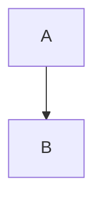

# point mass on a horizontal frictionless surface
motion of a point mass on a horizontal frictionless surface

<svg xmlns="http://www.w3.org/2000/svg" width="200" height="200" viewBox="0 0 200 200">
  <circle id="circle--red" cx="30" cy="30" r="30" fill="#f00"/>
</svg>

$$
ax^2 + bx + c
$$

